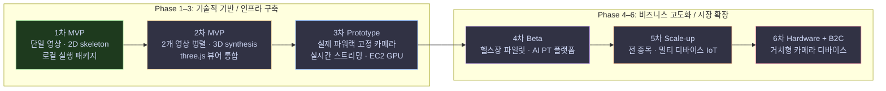
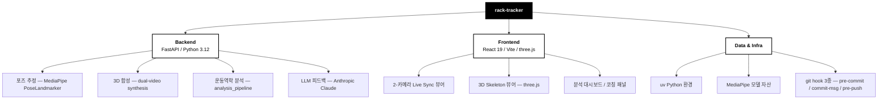
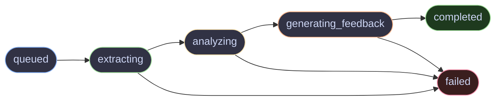
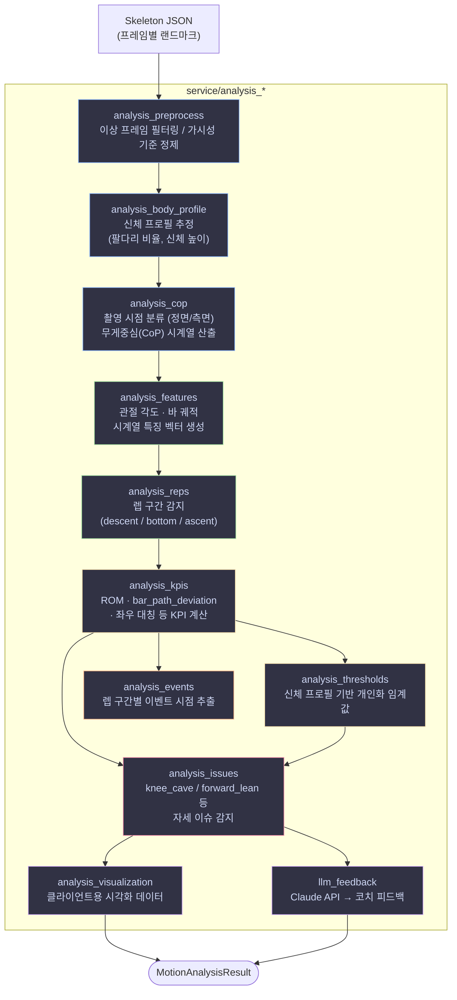
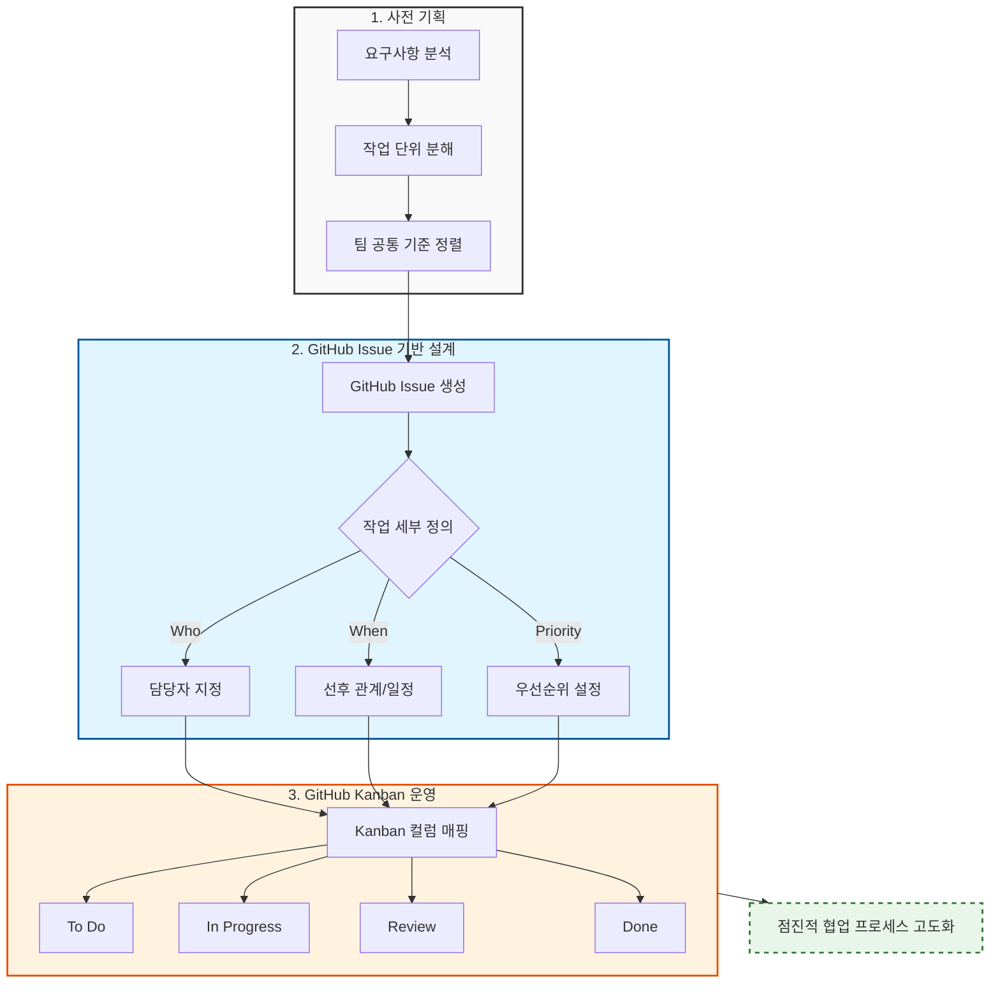
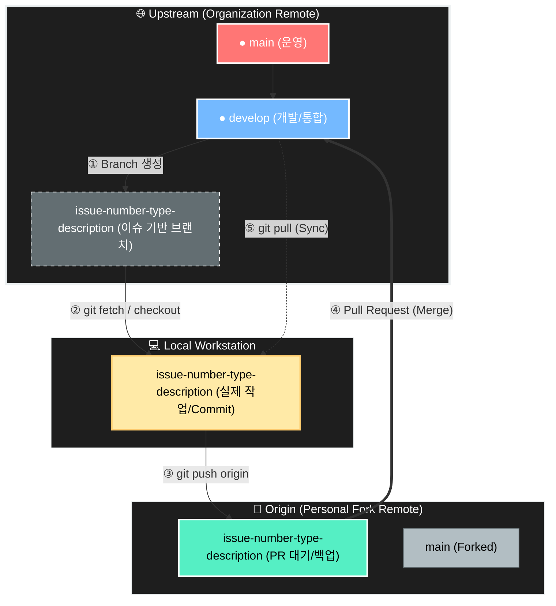
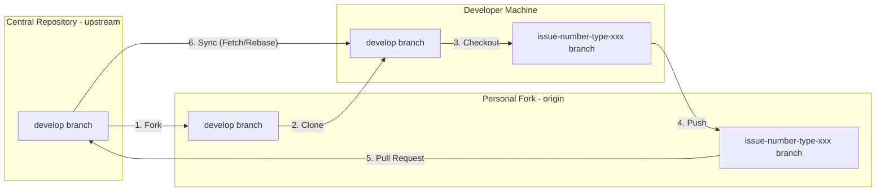
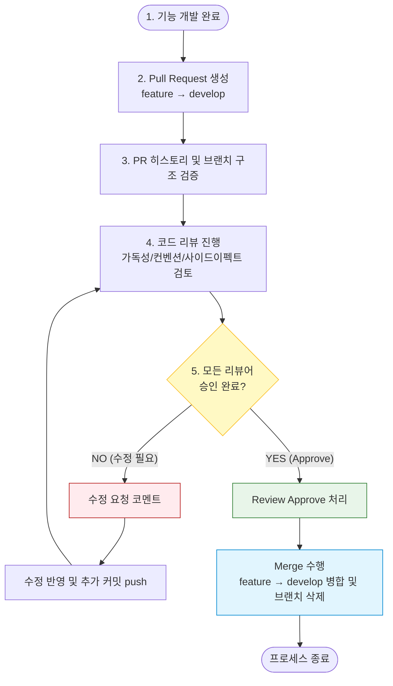

# AI 기반 랙 운동 자세 추적 및 분석 프로젝트

> 컴퓨터 비전과 AI 포즈 추정을 활용한 랙 기반 근력 운동 모션 트래킹 시스템

이 저장소는 **랙(Rack) 기반 근력 운동 동영상**을 입력으로 받아, 2D/3D 포즈 추정 → 운동역학 분석 → LLM 피드백까지의 파이프라인을 한 번에 다루는 풀스택 MVP다. 백엔드는 FastAPI + MediaPipe, 프론트엔드는 React 19 + three.js로 구성되어 있다.

> ⚠️ **본 저장소의 운영 위치** — `Rack-Venture/rack-tracker` 는 **창업경진대회 출전용 상업 버전**이다. 동일 제품을 다루는 자매 저장소 `rack-labs/rack-tracker`(졸업 프로젝트 전용, 연구·학술용)와 코드베이스 출발점은 같지만 **완전히 별도로 운영**된다. 본 저장소는 졸업 프로젝트 팀원 + 외부 인원이 함께 기여할 수 있는 commercial org에 속한다. 두 저장소의 차이는 [제품 정체성](#제품-정체성)을 참조.

---

# 목차

1. [팀 구성](#팀-구성)
2. [프로젝트 개요](#프로젝트-개요)
   - [제품 정체성](#제품-정체성)
   - [왜 만드는가](#왜-만드는가)
   - [누구를 위해](#누구를-위해)
   - [무엇이 다른가](#무엇이-다른가)
   - [단계별 실현 로드맵](#단계별-실현-로드맵)
3. [저장소 구조](#저장소-구조)
4. [백엔드 아키텍처](#백엔드-아키텍처)
5. [프론트엔드 아키텍처](#프론트엔드-아키텍처)
6. [데이터 분석 파이프라인](#데이터-분석-파이프라인)
7. [팀 역할 매트릭스](#팀-역할-매트릭스)
8. [로컬 설정](#로컬-설정)
9. [문서 안내](#문서-안내)
10. [협업 프로세스](#협업-프로세스)
    - [Convention First, Code Later](#convention-first-code-later)
    - [Fork 기반 협업 구조](#fork-기반-협업-구조)
    - [Branch 전략 및 명명 규칙](#branch-전략-및-명명-규칙)
    - [커밋 컨벤션](#커밋-컨벤션)
    - [이슈 기반 작업 관리](#이슈-기반-작업-관리)
    - [코드 리뷰 프로세스](#코드-리뷰-프로세스)

---

# 팀 구성

| 프로필 | 이름 | 소속 / 신분 | 담당 영역 | 핵심 책임 | 약력 |
| :---: | :--- | :--- | :--- | :--- | :--- |
|  | **이&nbsp;현&nbsp;규** | 상명대학교 — 학생 (Founder / Team Lead) | Core / AI · 사업화 | 프로젝트 리드. 포즈 추정·3D synthesis 파이프라인 설계 및 구현, AI 모델 어댑터 레이어 분리한 모듈형 아키텍처 설계, FastAPI 비동기 처리 구조 직접 구현. 사업화 방향 정렬과 협업·문서 체계 수립. | <ul><li>상명대학교 경제금융학 + 휴먼AI공학 (복수전공)</li><li>(전) 다국적 웹 에이전시 PM</li><li>(주)모두의연구소 — 응용소프트엔지니어링 과정 이수</li><li>NVIDIA 전담 AI 코어 엔지니어 교육과정 (SeSAC 서대문캠퍼스) — 2026-05-16~ 수료중</li></ul> |
| — | **김&nbsp;미&nbsp;루** | 상명대학교 — 학생 | Backend / DevOps | 풀스택·DevOps 핵심 개발. 백엔드 아키텍처 설계, 네트워크 인프라 구축, DevOps 파이프라인 설계, AI 기반 데이터 처리 시스템 개발. 헬스장 현장 수집 영상·운동 데이터의 안정적 처리와 지속적 배포·운영 기반 구축. | (본인 작성 영역) |
| — | **이&nbsp;지&nbsp;원** | 상명대학교 — 학생 | Frontend | 프론트엔드 구현, 데이터 처리, 서비스 인프라 구축. 운동 분석 결과를 직관적으로 확인할 수 있는 화면 구성·시각화 기능 구현, 분석 데이터의 효과적 전달. | (본인 작성 영역) |
| — | **전&nbsp;효&nbsp;원** | 상명대학교 — 학생 | Data Analyst | 데이터 수집·정제 파이프라인 구축, 분석 지표 설계, 사용자 행동 기반 인사이트 도출. 리포트 품질 향상과 서비스 개선 방향 도출. | (본인 작성 영역) |
| — | **전&nbsp;태&nbsp;웅** | 현대모비스 — 연구원 | Biomechanics R&D | 물리학 기반 운동역학 분석 모델 설계·고도화. 단순 자세 인식을 넘어 관절 정렬, 움직임 궤적, 반복 수행 패턴, 좌우 비대칭 등 **운동 수행 품질 해석** 로직 설계. | <ul><li>University of Warwick 기계공학 석사</li><li>(전) 한화에어로스페이스 연구원</li><li>(현) 현대모비스 연구원</li><li>표준화된 R&D 경험 기반</li></ul> |

> 본 저장소는 졸업 프로젝트 팀원(이현규·이지원·전효원)과 외부 인원(김미루·전태웅)이 함께 기여하는 commercial org에 속한다. 자매 저장소 `rack-labs/rack-tracker`는 졸프 전용으로 별도 운영되며, 그쪽 팀에는 본 저장소에 없는 장효인·신은수가 합류한다. 약력 칸은 외부 공개용 README이므로 본인이 공개 가능한 범위만 채운다.

## 자문 및 외부 협력

| 자문/파트너 | 역할 |
| --- | --- |
| **윤희남 교수** (상명대학교) | AI · 컴퓨터비전 지도 자문 |
| **(주)위니브** | 창업·서비스 기획 컨설팅 |
| **NVIDIA / SeSAC 서대문캠퍼스** | AI 코어 엔지니어 교육과정 연계 (`이현규` 2026-05-16 선발) |
| **WUAL** (네트워크-다국적 웹 에이전시) | 클라우드 인프라 자문 |

---

# 프로젝트 개요

## 제품 정체성

본 프로젝트는 **산출물·연구 개발팀·사업화 팀**을 세 이름으로 분리해 부른다.

| 이름 | 정체 |
| --- | --- |
| **RackTracker** | 산출물(소프트웨어). 본 저장소(`Rack-Venture/rack-tracker`)와 자매 저장소가 만드는 것. |
| **RackLabs** | 산출물을 **연구·학술 관점에서** 개발하는 팀. 자매 저장소 `rack-labs/rack-tracker`(졸업 프로젝트 전용)의 컨트리뷰터. |
| **RackVenture** | RackLabs의 연구 성과를 **사업화**하는 팀. 본 저장소의 컨트리뷰터(졸프 팀원 + 외부 인원). |

| 항목 | `rack-labs/rack-tracker` (자매) | `Rack-Venture/rack-tracker` (본 저장소) |
| --- | --- | --- |
| 목적 | 졸업 프로젝트 전용 · 연구·학술 | 창업경진대회 출전용 · **상업 버전** |
| 기여 가능 인원 | 졸프 팀원만 | 졸프 팀원 + 외부 인원 |
| 라이선스 / 운영 | 학술 라이선스 정책 | 상업 라이선스 정책 |
| 제품 목표·지향점 | 동일 | 동일 |

> 두 저장소는 코드베이스 출발점은 같지만 라이선스·기여자·운영 정책이 다르다. 외부 인원이 자매 저장소(`rack-labs/rack-tracker`)에 직접 기여하면 졸업 프로젝트 부정행위 이슈가 발생하므로, **외부 인원은 반드시 본 저장소(`Rack-Venture/rack-tracker`)에 기여**한다.

## 한 줄 요약

> 파워랙에 고정된 다각도 RGB 카메라와 AI로 프리웨이트 운동을 **관절 기반 시계열**로 분석해, 트레이너 · 소비자 · 헬스장 모두가 활용 가능한 **데이터 기반 피드백**을 제공한다.

## 왜 만드는가

프리웨이트 운동 시장은 다음 구조적 한계를 동시에 가진다.

- **경험 의존, 비표준화된 지도** — 헬스장 5년 내 폐업률 약 82%, 단기 이탈률 약 71%. 트레이너 개인 역량에 따라 지도 품질이 크게 변동(자료: 통계청, Mordor Intelligence).
- **정보 비대칭** — 소비자는 자세 정확성·부상 위험·코칭 품질을 사전 검증할 수 없다(전형적 Agency Problem).
- **기존 솔루션의 CAPEX 부담** — 센서·머신 기반 분석 장비는 초기 투자 비용이 수천만 원대.
- **규제 환경 변화** — 2026년 체육시설법 개정으로 국가공인 자격 의무화. **전문성의 객관적 증명 체계**가 필수 인프라가 되는 전환기.

RackTracker는 **파워랙에 고정된 다각도 RGB 카메라 + 비전 기반 AI**라는 비접촉 구조로, 추가 하드웨어 없이 운동 수행 품질·부상 위험·개선 성과를 정량적으로 **측정·기록·검증**한다.

## 누구를 위해

| 이해관계자 | 제공 가치 |
| --- | --- |
| **소비자** | 트레이너 의존 없이도 자세 정확성·부상 위험·개선 추세를 데이터로 확인. 정보 비대칭 해소. |
| **트레이너** | 지도 품질과 개선 성과를 객관 지표로 증명. 영업 인력이 아닌 전문가로 포지셔닝 가능. |
| **헬스장** | 추가 CAPEX 없이 운동 품질 관리·프리미엄 서비스 운영이 가능한 차별화된 데이터 인프라. |

## 무엇이 다른가

1. **비접촉·비전 기반** — 기존 파워랙 환경 그대로 활용. 하드웨어 의존·CAPEX 구조 제거.
2. **프리웨이트 3D 분석** — 머신 기반 솔루션이 다루지 못하는 복합 다관절 운동의 3차원 부하 전달까지 분석.
3. **촬영 환경 표준화** — 파워랙 고정 마운트로 동일 조건 반복 측정. 분석 재현성·신뢰도 확보.
4. **데이터 락인** — 운동 이력·분석 기록 누적이 헬스장/트레이너의 전환 비용을 키운다(단순 SaaS가 아닌 운영 인프라).
5. **규제 대응을 경쟁력으로** — 자격 기반 시장에서 전문성을 정량적으로 증명할 수 있는 도구로 포지셔닝.

## 기술 목표 (저장소 관점)

- AI 포즈 추정(MediaPipe PoseLandmarker)을 기반으로 랙 운동의 자세를 정량 분석한다.
- 단일 영상(2D)뿐 아니라 2-카메라(좌/우) 입력을 합쳐 **3D 스켈레톤 합성(synthesis)** 까지 다룬다.
- 분석 결과를 LLM 피드백으로 변환해 코칭 텍스트를 자동 생성한다.
- 모든 기능 구현과 더불어 **GitHub 이슈 기반 협업 프로세스**를 실제로 운영·정착시키는 것을 동등하게 중요한 목표로 둔다.

## 단계별 실현 로드맵



| 단계 | 현황 | 핵심 산출물 | 본 저장소 매핑 |
| --- | --- | --- | --- |
| **1차 MVP** | ✅ 완료 (2026-04, 자매 저장소 산출물) | 단일 영상 CNN 관절 추정, 2D 스켈레톤 시계열, 기본 분석 지표, 로컬 실행 패키지 | `docs/archive/mvp-v1/` (참고용) |
| **2차 MVP** | 🔧 마무리 중 (2026-05) | 2-view 영상 병렬 처리 → 3D skeleton synthesis, three.js 뷰어 통합, 운동역학 지표 고도화 | `backend/`, `frontend/` (코드베이스 마이그레이션 완료, 본 저장소 활성 작업) |
| **3차 Prototype** | ⏭️ 착수 예정 | 실제 파워랙 고정 카메라, 실시간 스트리밍, SFF 장비 + Amazon EC2 GPU 인프라, DB 도입 | 미반영 |
| **4차 Beta** | 📋 계획 | 프리미엄 헬스장 파일럿, AI Personal Training 플랫폼, 성과 공유·인증·트래킹 커뮤니티 | 미반영 |
| **5차 Scale-up** | 📋 계획 | 전 종목 분석 확장, 헬스장 천장 마운팅 레일 기반 멀티 디바이스 IoT(비전 + 센서) | 미반영 |
| **6차 Hardware + B2C** | 📋 계획 | 자석 부착·거치형 다각도 카메라 디바이스, 개인 소비자 시장 진출 | 미반영 |

본 저장소는 **자매 저장소(`rack-labs/rack-tracker`)의 MVP v2 뼈대를 마이그레이션한 상태**로 출범했으며, 현재 2차 MVP 마무리와 외부 인원 합류를 동시에 준비하고 있다. 본 저장소의 진행 중 작업은 [GitHub Issues](https://github.com/Rack-Venture/rack-tracker/issues)에서 추적한다.

## 범위 (Project Scope)



---

# 저장소 구조

| 경로 | 설명 |
| --- | --- |
| `backend/` | FastAPI 백엔드. uv로 Python 3.12 환경을 관리한다. |
| `frontend/` | Vite + React 19 프론트엔드. three.js 기반 3D 스켈레톤 뷰어 포함. |
| `docs/` | 모든 설계·운영·이슈 문서. 자세한 구조는 [문서 안내](#문서-안내) 참조. |
| `docs/issues/` | 본 저장소의 활성 이슈 관리 문서(`chore/`, `docs/`, 향후 type별 디렉터리 추가). |
| `docs/agent-workflow/` | 협업·문서·git 컨벤션과 템플릿. |
| `docs/mvp-v2/` | MVP v2 진입점 인덱스. |
| `docs/archive/` | 자매 저장소에서 가져온 레거시 문서(`mvp-v1/`, `mvp-v2/`)의 보존본. |
| `docs/onboarding.md` | 신규 팀원용 로컬 셋업 가이드. |
| `.githooks/` | `pre-commit`, `commit-msg`, `pre-push` 3종 git hook. |
| `scripts/` | 저장소 유지보수 PowerShell 스크립트와 데이터 다운로드 스크립트(`download_data.py`). |
| `171204_pose1/` | 외부 평가 데이터(예: `hdVideos_2min`)가 위치하는 디렉터리(git 미포함 자산 포함). |

---

# 백엔드 아키텍처

> `backend/` — FastAPI 기반 동작 분석 백엔드. uv 패키지 관리 + Python 3.12.

## 6-Layer 아키텍처 스택

| Layer | 경로 | 역할 |
| --- | --- | --- |
| **Entry** | `main.py` | uvicorn 서버 진입점. `RELOAD` 환경 변수로 hot reload 토글. |
| **App** | `app.py` | FastAPI 앱 구성. GZip 미들웨어, CORS(`localhost:5173/5174`), 6개 라우터 등록. |
| **Controller** | `controller/` | HTTP 라우터. 요청 파싱과 응답 직렬화만 담당. |
| **Service** | `service/` | 모든 핵심 비즈니스 로직(추론·합성·분석·피드백·job 관리). |
| **Adapter** | `adapter/` | OpenCV, MediaPipe 등 외부 라이브러리 경계 격리. |
| **Schema** | `schema/` | Pydantic 데이터 모델, 요청·응답 직렬화. |

## Controller — HTTP 엔드포인트

| Router | Prefix | 주요 엔드포인트 |
| --- | --- | --- |
| `controller/health.py` | `/` | `GET /` — 헬스 체크. |
| `controller/jobs.py` | `/jobs` | `POST /jobs` (deprecated, `/synthesis/jobs`로 대체 예정), `GET /jobs/{id}`, `GET /jobs/{id}/stream` (SSE 진행 상태). |
| `controller/results.py` | `/jobs` | `GET /jobs/{id}/result`, `GET /jobs/{id}/skeleton`(페이지네이션), `GET /jobs/{id}/skeleton/download`, `GET /jobs/{id}/benchmark`, `GET /jobs/{id}/benchmark/frames`. |
| `controller/analysis.py` | `/analysis` | `POST /analysis/preview` — 동기 즉시 분석(샘플 비디오 대체 가능). |
| `controller/synthesis.py` | `/synthesis` | `POST /synthesis/upload`, `POST /synthesis/jobs`, `GET /synthesis/jobs/{id}`, `GET /synthesis/jobs/{id}/result`, `GET /synthesis/jobs/{id}/skeleton3d{,/all}`, `GET /synthesis/jobs/{id}/skeleton_a`. 2-카메라 streaming 합성 파이프라인의 진입점. |
| `controller/rack_motion.py` | `/rack-motion` | `GET /rack-motion/fixtures/stage1`, `GET /rack-motion/from-synthesis/{id}/stage1` — 3D 스켈레톤에서 Stage1 랙 모션 뷰어 데이터 산출. |

## 비동기 Job 파이프라인

영상 처리는 단일 요청-응답으로 끝낼 수 없어 두 가지 비동기 Job 매니저가 공존한다.

| 매니저 | 위치 | 역할 |
| --- | --- | --- |
| `job_manager` | `service/job_manager.py` | 단일 영상 2D 파이프라인 (frame extract → MediaPipe pose → analysis → LLM). 점진적으로 `synthesis_job_manager`로 통합 중. |
| `synthesis_job_manager` | `service/synthesis_job_manager.py` | 2-카메라 streaming synthesis 파이프라인. `DualVideoSynthesisCoordinator`로 좌/우 영상의 chunk 단위 동기화 수행. |

### Job State Machine



## Service — 핵심 모듈

분석/합성/추론 흐름의 모든 실제 로직은 `service/`에 집중되어 있다.

| 영역 | 파일 | 역할 |
| --- | --- | --- |
| **Job orchestration** | `job_manager.py` | 단일 영상 5단계 파이프라인 오케스트레이션 (frame → pose → skeleton → analysis → llm). |
| | `synthesis_job_manager.py` | 2-카메라 streaming 합성 job 매니저. |
| | `dual_video_synthesis_coordinator.py` | 좌/우 영상의 chunk 정렬과 backpressure 제어. |
| **Frame & pose** | `video_reader.py` | OpenCV 기반 프레임 추출(Iterator). |
| | `pose_inference.py` | MediaPipe 호출 오케스트레이션, 결과 직렬화. |
| | `skeleton_mapper.py` | MediaPipe 33 landmark → 내부 skeleton schema 매핑. |
| | `landmark_observation.py` | landmark 품질·관측 메타데이터 계산. |
| **3D synthesis** | `skeleton_3d_synthesizer.py` | 2-view skeleton에서 3D skeleton 합성(triangulation 기반). |
| | `triangulation.py` | 두 카메라 좌표쌍 → 3D 점 추정. |
| | `camera_calibration.py` | 카메라 calibration 데이터 로딩. |
| | `frame_alignment.py` | 좌/우 영상 프레임 시간 동기화. |
| | `skeleton_3d_evaluator.py` | 합성 결과 평가(예: GT skeleton과 비교). |
| | `skeleton3d_to_rack_mapper.py` | 3D skeleton → 랙 모션 fixture 변환. |
| **Analysis** | `analysis_pipeline.py` | 분석 흐름 오케스트레이션. |
| | `analysis_preprocess.py` | 가시성 임계값 이하 프레임 정제. |
| | `analysis_body_profile.py` | 팔다리 비율, 신체 높이 추정. |
| | `analysis_cop.py` | 촬영 시점 분류, 무게중심(CoP) 시계열. |
| | `analysis_features.py` | 관절 각도, 바 궤적, 좌우 대칭 등 특징 벡터. |
| | `analysis_reps.py` | 하강·최저점·상승 구간 감지. |
| | `analysis_kpis.py` | ROM, 바 경로 편차 등 KPI. |
| | `analysis_thresholds.py` | 신체 프로필 기반 개인화 임계값. |
| | `analysis_events.py` | 렙 구간별 이벤트 시점 추출. |
| | `analysis_issues.py` | knee_cave, forward_lean 등 자세 이슈 판정. |
| | `analysis_visualization.py` | 클라이언트 시각화용 오버레이 데이터. |
| **LLM** | `llm_feedback.py` | Claude API 호출 → 강점·교정·코치 큐 생성. |
| | `llm_prompt_payload.py` | LLM 프롬프트 페이로드 조립. |
| **Repositories** | `rack_motion_repository.py` | 랙 모션 fixture I/O. |
| | `skeleton_artifact_repository.py` | skeleton/skeleton3d artifact I/O. |
| **Observability** | `benchmarking.py` | 단계별 latency, delegate fallback 등 벤치마크 수집. |

## Adapter — 외부 라이브러리 경계

| 파일 | 격리 대상 |
| --- | --- |
| `adapter/mediapipe_adapter.py` | MediaPipe Vision API (PoseLandmarker 초기화/추론/정리). |
| `adapter/opencv_adapter.py` | OpenCV `cv2.VideoCapture` 등 영상 I/O. |

> Adapter는 외부 라이브러리를 직접 만지는 유일한 경계다. Service는 항상 adapter를 경유한다.

## Schema — 데이터 계약

| 파일 | 역할 |
| --- | --- |
| `schema/job.py` | Job 생성/상태/에러 응답 모델. |
| `schema/frame.py` | `FrameExtractionOptions`, `FrameChunk` 등 프레임 단위 모델. |
| `schema/pose.py` | `PoseChunk`, `PoseFrameResult`, `AlignedPoseChunkPair`. |
| `schema/result.py` | 최종 응답(`MotionAnalysisSummary`, `SkeletonPageResponse`). 3분할 데이터 계약(`skeleton`, `analysis`, `llmFeedback`)의 source of truth. |
| `schema/synthesis.py` | streaming 합성 입력/출력 모델. |
| `schema/rack_motion.py` | Stage1 랙 모션 뷰어 fixture 모델. |
| `schema/benchmark.py` | 벤치마크 응답 모델. |

## 프론트엔드와의 통신 규약

| 엔드포인트 | 흐름 |
| --- | --- |
| `POST /synthesis/jobs` | 좌/우 영상 path로 streaming 합성 job 생성 → `job_id` 즉시 반환. |
| `GET /synthesis/jobs/{id}` | 상태 폴링. queued → extracting → analyzing → generating_feedback → completed. |
| `GET /synthesis/jobs/{id}/result` | 최종 결과 요약. |
| `GET /synthesis/jobs/{id}/skeleton3d` | 3D skeleton 프레임 페이지(`offset`, `limit`). |
| `GET /rack-motion/from-synthesis/{id}/stage1` | 3D skeleton에서 산출한 Stage1 뷰어용 fixture. |

---

# 프론트엔드 아키텍처

> `frontend/` — Vite + React 19 + three.js. 백엔드의 streaming synthesis 파이프라인을 시각화하는 단일 페이지 데모.

## 기술 스택

| 영역 | 채택 |
| --- | --- |
| 빌드 / dev server | Vite 7 |
| UI 프레임워크 | React 19, React DOM 19 |
| 3D 렌더링 | three.js 0.184 |
| 폰트 | pretendard |
| 린트 | ESLint 9 + react-hooks / react-refresh 플러그인 |

기본 dev URL은 `http://localhost:5173`이고, 백엔드 주소는 `VITE_API_BASE_URL`이 비어 있으면 `http://127.0.0.1:8000`으로 fallback된다.

## 페이지 구성

`src/App.jsx`는 4개 섹션을 한 화면에 세로로 합쳐 보여주는 단일 페이지 구조다.

| 순서 | 섹션 | 파일 | 역할 |
| --- | --- | --- | --- |
| 1 | Core Demo | `components/sections/CoreDemoSection/` | 합성 세션의 핵심 입력/출력을 가장 위에서 시연. |
| 2 | Live Sync (2-camera) | `components/sections/LiveSyncSection/` | 좌/우 영상과 2D skeleton 오버레이를 나란히 동기 재생. |
| 3 | 3D Skeleton Synthesis | `components/sections/Skeleton3DSynthesisSection/` | three.js 기반 3D skeleton 뷰어. 합성 job 진행/완료 결과를 시각화. |
| 4 | Rack Motion Stage 1 | `components/sections/RackMotionStage1Section/` | 합성된 3D skeleton에서 산출된 랙 모션 fixture 패널. |

기타 섹션 컴포넌트로 `HeroSection`, `MainHeader`, `Footer`, `TechnicalPipelineSection`, `AnalysisDashboardSection`가 존재한다.

## 공통 컴포넌트

`src/components/` 하위에 모듈 단위 CSS와 함께 정의된다.

| 컴포넌트 | 역할 |
| --- | --- |
| `SkeletonViewer/` | 2D skeleton 오버레이 캔버스. `hooks/useVideoSync.js`, `utils/drawSkeleton.js`, `utils/poseEdges.js`, `utils/computeJointLoad.js` 포함. |
| `Panel/` | 섹션 내부 카드 컨테이너. |
| `VideoUpload/` | 비디오 업로드 입력. |
| `VisualizationSettings/`, `FpsSelector/`, `Toggle/` | 시각화 옵션 UI. |
| `MetricsList/` | 분석 KPI 리스트. |
| `LlmFeedback/` | LLM 피드백 패널. |
| `RawSkeletonJson/` | 디버그용 raw JSON 뷰어. |
| `ScrollToTopButton/` | 페이지 상단 이동 버튼. |
| `Button/`, `SectionContainer/` | 기본 UI 프리미티브. |

## 상태 관리 (features/)

| 훅 | 역할 |
| --- | --- |
| `features/analysis-session/useAnalysisSession.js` | 단일 영상 분석 세션 상태. `LiveSync`에서 좌/우 각각 인스턴스화. |
| `features/synthesis-session/useSynthesisSession.js` | streaming synthesis job 세션 상태(업로드 → job 생성 → polling → 결과). |
| `api/analysisClient.js` | 백엔드 호출 fetch wrapper. |

## 데모 화면

> 아래 placeholder 위치에 캡처를 직접 삽입한다.

### Core Demo / Hero

<!-- TODO: screenshot - Core Demo 섹션 (입력 → 합성 → 출력 데모 흐름) -->

### Live Sync 뷰어

<!-- TODO: screenshot - 좌/우 영상 + 2D skeleton 오버레이 동기 재생 -->

### 3D Skeleton 합성 뷰어

<!-- TODO: screenshot - three.js 기반 3D 스켈레톤 뷰어, 합성 결과 -->

### Rack Motion Stage 1 패널

<!-- TODO: screenshot - 합성된 3D skeleton에서 도출한 Stage 1 랙 모션 뷰어 -->

> 캡처 자산은 `frontend/src/assets/readme-source/` 아래에 보관한 뒤 README에서 상대 경로로 참조한다.

---

# 데이터 분석 파이프라인

> Skeleton JSON → 자세 분석 결과. LLM 없이도 독립적으로 동작하는 biomechanics 엔진.



핵심은 다음 3분할 데이터 계약이다(`schema/result.py`).

```jsonc
{
  "skeleton":   { /* 비디오 오버레이 UI용 프레임별 랜드마크 */ },
  "analysis":   { /* 대시보드 차트용 KPI, repSegments, issues 등 */ },
  "llmFeedback": { /* 코칭 텍스트: overallComment, highlights, corrections, coachCue */ }
}
```

---

# 팀 역할 매트릭스

| 역할 | 집중 영역 | 주요 파일 |
| --- | --- | --- |
| **Core Developer** | 서버 / API / job orchestration. 합성·추론 파이프라인 연결. | `backend/main.py`, `app.py`, `controller/`, `service/job_manager.py`, `service/synthesis_job_manager.py`, `adapter/` |
| **Data Analyst** | 스켈레톤 기반 운동역학 알고리즘, 분석 지표 발굴. | `backend/service/analysis_pipeline.py`, `service/analysis_*`, `schema/result.py` |
| **Frontend Developer** | 데모 페이지·뷰어·시각화. 데이터 계약을 따라 UI에 매핑. | `frontend/src/App.jsx`, `components/sections/`, `components/SkeletonViewer/`, `features/synthesis-session/` |
| **AI / 3D** | SMPL·triangulation·camera calibration 기반 3D 합성. | `backend/service/skeleton_3d_synthesizer.py`, `triangulation.py`, `camera_calibration.py`, `frame_alignment.py` |

> 역할은 고정되지 않는다. 이슈 단위로 책임이 이동할 수 있다.

---

# 로컬 설정

신규 팀원의 셋업은 별도 가이드를 따른다.

> **[docs/onboarding.md](docs/onboarding.md)** — Node.js / uv / gh 사전 설치, fork·clone, frontend / backend 실행, MediaPipe 모델 다운로드, git hook 활성화, 세팅 완료 체크리스트.

핵심만 다시 옮기면 다음과 같다.

```bash
# 0) 사전 설치: Node.js 18+ LTS, uv, GitHub CLI

# 1) Fork 후 clone, upstream 설정
git clone https://github.com/<내-계정>/rack-tracker.git
cd rack-tracker
git remote add upstream https://github.com/Rack-Venture/rack-tracker.git

# 2) git hook 3종 활성화
git config core.hooksPath .githooks

# 3) 프론트엔드
cd frontend && npm install && npm run dev          # → http://localhost:5173

# 4) 백엔드
cd ../backend && uv sync && cp .env.example .env   # .env의 ANTHROPIC_API_KEY 채우기
uv run main.py                                     # → http://127.0.0.1:8000
```

git에 포함되지 않는 자산(MediaPipe 모델 파일, 테스트 영상, calibration JSON 등) 안내도 `docs/onboarding.md`에 있다. 데이터 일괄 다운로드 스크립트는 `scripts/download_data.py`를 참조한다.

---

# 문서 안내

| 경로 | 역할 |
| --- | --- |
| `AGENTS.md` | Agent용 진입점. 모든 에이전트는 세션 시작 시 이 문서를 먼저 읽는다. |
| `docs/README.md` | `docs/` 디렉터리 인덱스. |
| `docs/onboarding.md` | 신규 팀원 로컬 셋업 가이드(단일 진입점). |
| `docs/agent-workflow/README.md` | 협업 워크플로우 전체 구조. |
| `docs/agent-workflow/git-rules.md` | 브랜치·커밋·PR 규칙 요약. |
| `docs/agent-workflow/documentation-rules.md` | 작업 로그·관리 문서 규칙. |
| `docs/agent-workflow/templates.md` | 이슈·브랜치·커밋·PR·관리 문서 템플릿. |
| `docs/issues/<type>/` | 본 저장소의 활성 이슈 관리 문서. type별 디렉터리(`chore/`, `docs/` 등)로 분류. |
| `docs/mvp-v2/README.md` | MVP v2 진입점. |
| `docs/archive/README.md` | 자매 저장소에서 가져온 레거시 문서 보존본 인덱스. |
| `backend/README.md` | 백엔드 자체 입문 문서(비개발자 포함 팀원 친화). |

---

# 협업 프로세스

> 본 프로젝트는 AI 기능 구현뿐 아니라 **이슈 기반 GitHub 협업 시스템을 실제로 설계·운영**하는 것을 동등하게 중요한 목표로 한다.



## Convention First, Code Later

기능 개발에 앞서 협업의 토대를 먼저 견고히 한다. 저장소 생성 직후 브랜치 전략과 커밋 컨벤션을 먼저 확정하고 문서화한다.

- **브랜치 전략:** 이슈 번호 기반 브랜치 생성, `develop` 브랜치 중심 통합
- **커밋 규칙:** 타입 기반 커밋 메시지로 변경 의도 명확화
- **PR 프로세스:** 모든 변경은 PR로 공유, 리뷰 승인 후 병합

## Fork 기반 협업 구조



> 원본 레포지토리의 안정성을 최우선으로 유지하면서, 개인 단위 자유로운 개발과 팀 단위 통제된 통합을 동시에 달성하기 위한 구조다.

## Branch 전략 및 명명 규칙

> 모든 작업은 **`develop` 브랜치**를 기준으로 진행한다.

| 구분 | 내용 |
| --- | --- |
| **기준 브랜치** | `develop` (Single Source of Truth) |
| **작업 브랜치** | `<issue-number>-<type>-<short-description>` |
| **Push 대상** | `origin` (개인 Fork) |
| **PR 대상** | `origin/작업-브랜치` → `upstream/develop` |



### 브랜치 타입

| 타입 | 설명 | 예시 |
| --- | --- | --- |
| `feature` | 새로운 기능 추가 | `41-feature-video-upload-api` |
| `fix` | 버그 수정 | `52-fix-webcam-crash` |
| `hotfix` | 운영 중 발생한 긴급 버그 수정 | `hotfix/78-login-error` |
| `chore` | 설정 변경, 유지보수 등 기능 무관 작업 | `9-chore-flatten-171204-pose1-dir` |
| `docs` | 문서 수정 | `20-docs-overhaul-readme` |
| `test` | 테스트 코드 추가 또는 수정 | `35-test-pose-estimator` |
| `refactor` | 기능 변경 없는 코드 구조 개선 | `44-refactor-tracker-module` |
| `ci` | CI/CD 설정 및 자동화 파이프라인 수정 | `60-ci-update-github-actions` |

## 커밋 컨벤션

```text
type: short summary (#<issue-number>)

- change item 1
- change item 2
- change item 3
```

| Type | Description |
| --- | --- |
| `feat` | 새로운 기능 추가 |
| `fix` | 버그 수정 |
| `docs` | 문서 수정 |
| `style` | 코드 포맷, 세미콜론 등 스타일 수정 |
| `refactor` | 기능 변경 없는 구조 개선 |
| `perf` | 성능 개선 |
| `test` | 테스트 코드 추가 또는 수정 |
| `build` | 빌드 설정 변경 |
| `ci` | CI 설정 변경 |
| `chore` | 설정, 빌드, 기타 유지보수 작업 |
| `revert` | 이전 커밋 되돌리기 |
| `repo` | 저장소 구조 변경 (아카이브, 이동, 제거) |

> 커밋 메시지 포맷은 `commit-msg` git hook이 자동 검증한다. 자세한 규칙은 `docs/agent-workflow/git-rules.md` 참조.

## 이슈 기반 작업 관리

- 모든 작업은 GitHub Issue 생성 후 진행한다.
- Issue 단위로 브랜치를 생성한다(`<issue-number>-<type>-<short-description>`).
- 작업 범위·완료 조건·체크리스트를 Issue에 명시한다.
- PR은 반드시 관련 Issue를 연결해 생성한다(`Closes #<issue-number>`).
- 이슈/브랜치/커밋/PR의 type 분류는 위 [브랜치 타입](#브랜치-타입) 표를 공유한다.
- 진행 중인 작업은 `docs/issues/<type>/<issue-number>-<type>-<short-description>.md` 관리 문서를 함께 갱신한다.

## 코드 리뷰 프로세스



> 코드 리뷰 시 중점 검토 사항
> - 코드 가독성 및 컨벤션 준수 여부
> - 공통 모듈 영향도
> - 사이드 이펙트 발생 가능성
> - 불필요한 중복 코드 여부
