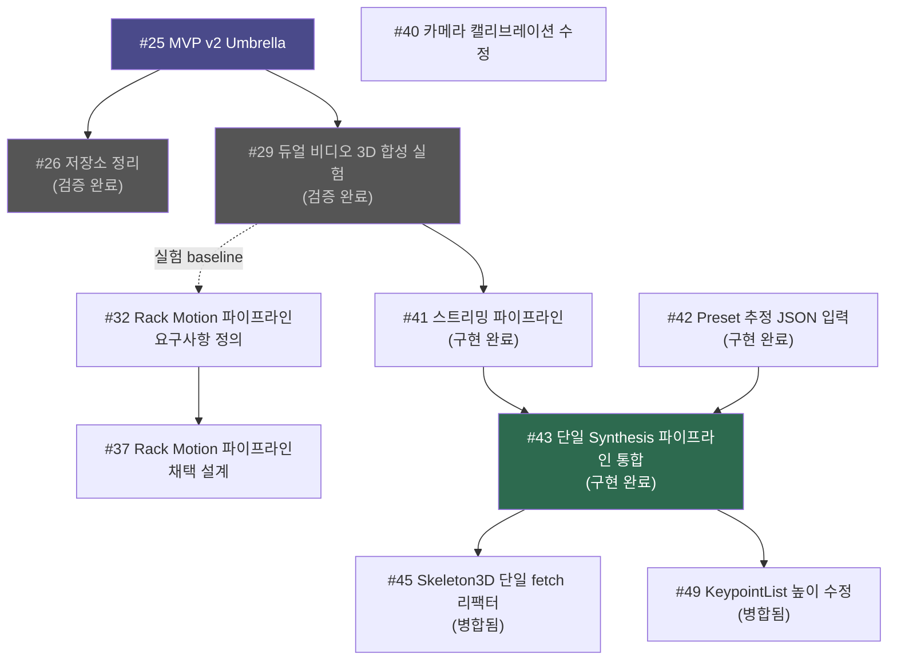
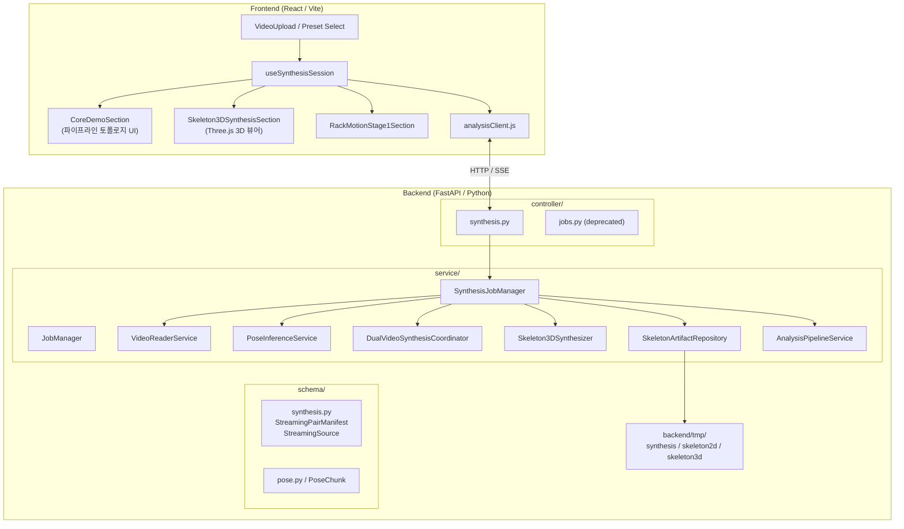
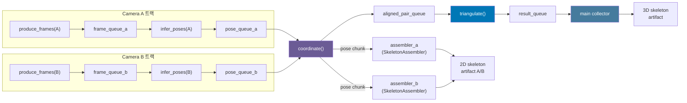
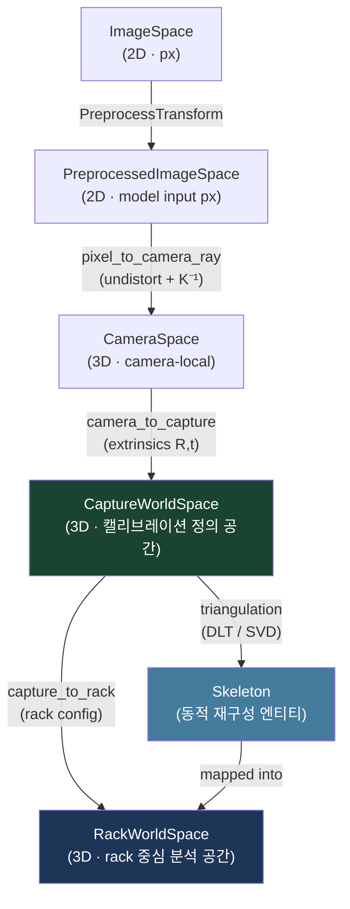
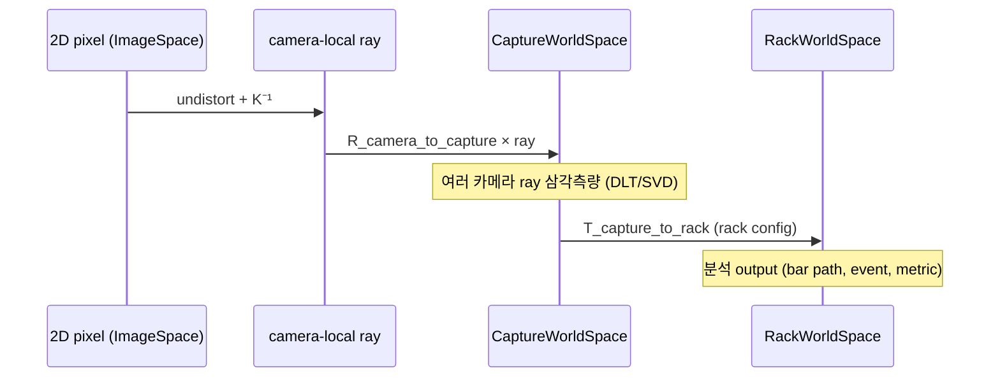
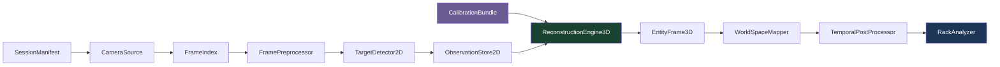

# MVP v2 개요

> 작성 기준: 2026-05-14  
> 기반 이슈: #25 (umbrella), #29, #32, #37, #41, #42, #43, #45, #49

---

## 목표와 배경

MVP v2는 단일 카메라 2D 랜드마크 추출(v1)에서 **듀얼 카메라 기반 3D 스켈레톤 합성**으로 파이프라인을 발전시킨다.  
단일 카메라의 깊이 정보 부재 한계를 극복하고, 향후 rack-centered 바벨/랙 모션 분석으로 이어지는 기반을 구축하는 것이 핵심 목표다.

**v1 → v2 핵심 변화**

| 항목 | MVP v1 | MVP v2 |
|------|--------|--------|
| 카메라 수 | 1 | 2 (듀얼) |
| 스켈레톤 차원 | 2D | 2D (부산물) + 3D (삼각측량) |
| 추론 실행 횟수 | 영상당 1회 | 전체 1회 (통합 파이프라인) |
| 프론트엔드 추적 단위 | 개별 job A + B | 단일 synthesis job |
| 분석 공간 | 이미지 픽셀 공간 | CaptureWorldSpace → RackWorldSpace |

---

## 이슈 관계도



---

## 시스템 레이어 아키텍처



---

## 합성 파이프라인 흐름

### 이전 구조 (중복 추론 — #43 이전)

```
createJob(A)  → OpenCV → MediaPipe 추론A → 2D 스켈레톤A   ← job_manager
createJob(B)  → OpenCV → MediaPipe 추론B → 2D 스켈레톤B   ← job_manager

createStreamingSynthesisJob(A, B)
  → OpenCV A → MediaPipe 추론A ─┬─► 삼각측량 → 3D         ← synthesis_job_manager
  → OpenCV B → MediaPipe 추론B ─┘
```

동일 비디오에 대해 MediaPipe 추론이 **2회** 실행되는 문제 존재.

---

### 현재 구조 (통합 파이프라인 — #43 이후)

```
createSynthesisJob(videoA, videoB)
  → OpenCV 읽기A → MediaPipe 추론A ─┬─► 2D 스켈레톤A (부산물 저장)
                                      ├─► 삼각측량 → 3D 스켈레톤
  → OpenCV 읽기B → MediaPipe 추론B ─┴─► 2D 스켈레톤B (부산물 저장)
```

추론을 **1회**만 실행하고, 결과를 2D 저장과 3D 삼각측량에 **동시** 활용한다.

---

### Preset 모드 (추론 없이 삼각측량만)

```
load_preset_poses(presetId_A) → pose_queue_a ─┐
load_preset_poses(presetId_B) → pose_queue_b ─┤
                                               └→ coordinate() → triangulate() → 3D
```

`StreamingSource.presetEstimationId` 필드로 소스별 독립 선택 가능.

---

## 스레드 토폴로지



`coordinate()` 함수가 양쪽 pose_queue를 구독하는 자연스러운 fan-out 지점이며, 여기서 2D assembler와 삼각측량 큐에 동시 전달한다.

---

## 추상 월드 개념 (Coordinate Spaces)

### 공간 계층 시각화



### 공간 정의 표

| 공간 | 차원 | 원점 | 단위 | 역할 |
|------|------|------|------|------|
| `ImageSpace` | 2D | decoded image 좌상단 픽셀 | px | 원본 카메라 이미지 좌표. 모든 영구 2D 관측의 기준 공간 |
| `PreprocessedImageSpace` | 2D | detector input 좌상단 | model input px | resize·crop·padding 후 모델 입력 공간. 영구 저장 금지 |
| `CameraSpace` | 3D | camera optical center | calibration unit | 카메라 로컬 3D. ray 역투영의 시작점 |
| `CaptureWorldSpace` | 3D | 캘리브레이션 정의 world origin | calibration unit | 다중 카메라 삼각측량이 이루어지는 **재구성 공간**. rack에 자동 정렬되지 않음 |
| `RackWorldSpace` | 3D | rack centerline × floor | meter (권장) | bar path, rack proximity, event 분석의 **도메인 분석 공간** |
| `Skeleton` | — | (RackWorldSpace 내 동적) | — | CaptureWorldSpace에서 재구성 후 RackWorldSpace로 매핑되는 동적 엔티티. world 자체를 정의하지 않음 |

### 핵심 불변 규칙

```
calibration  → defines CaptureWorldSpace
rack config  → defines RackWorldSpace
cameras      → fixed sensors in CaptureWorldSpace (skeleton이 아님)
skeleton     → reconstructed inside CaptureWorldSpace, mapped to RackWorldSpace
skeleton     → NEVER defines RackWorldSpace
```

### 좌표 변환 흐름



### Transform 방향 표

| Transform | 방향 | 용도 |
|-----------|------|------|
| `image_to_preprocessed` | ImageSpace → PreprocessedImageSpace | 원본 픽셀 → detector input |
| `preprocessed_to_image` | PreprocessedImageSpace → ImageSpace | detector 출력 → 영구 저장 |
| `pixel_to_camera_ray` | ImageSpace → CameraSpace ray | undistort + K⁻¹ |
| `camera_to_capture` | CameraSpace → CaptureWorldSpace | extrinsics R, t |
| `capture_to_camera` | CaptureWorldSpace → CameraSpace | 3D → 2D reproject (진단) |
| `capture_to_rack` | CaptureWorldSpace → RackWorldSpace | 재구성 결과 → 분석 좌표 |
| `rack_to_capture` | RackWorldSpace → CaptureWorldSpace | rack 정의 디버깅 |
| `camera_to_rack` | CameraSpace → RackWorldSpace | rack-relative calibration 전용 |

---

## 파이프라인 단계 계약



| 단계 | 입력 | 출력 | 주요 실패 조건 |
|------|------|------|----------------|
| `SessionManifest` | 카메라 소스, 처리 설정, 캘리브레이션 번들 | 버전 관리 manifest (camera/target id, artifact 위치) | 소스 없음, 중복 id, 지원 안 되는 미디어 |
| `CameraSource` | 비디오 파일 / 스트림 | camera_id, frame_index, timestamp, FPS, 이미지 크기 | 파일 열기 실패, 지원 안 되는 코덱 |
| `FrameIndex` | 카메라 메타데이터, 프레임 수, timestamp | 동기화 그룹, 프레임 가용성 테이블 | 빈 카메라 집합, 조정 불가 범위 |
| `FramePreprocessor` | 원본 이미지, 전처리 설정 | 전처리 프레임 + PreprocessTransform | transform 표현 불가, 이미지 무효화 |
| `TargetDetector2D` | 전처리 프레임, detector adapter | `Observation2D` (ImageSpace 좌표) | detector 불가, 타깃 스키마 비호환 |
| `ObservationStore2D` | Observation2D, camera/frame id | 검증된 카메라별 2D 관측 store | shape 불일치, 좌표 공간 오류 |
| `CalibrationBundle` | rack-tracker 소유 JSON/TOML, 캘리브레이션 미디어 | `CaptureWorldSpace`, 캘리브레이션 품질 보고서 | intrinsics/extrinsics 누락, unit mismatch |
| `ReconstructionEngine3D` | Observation2D + CalibrationBundle | `Reconstruction3D` (CaptureWorldSpace), reprojection error | 카메라 부족, 높은 불확실성 |
| `EntityFrame3D` | Reconstruction3D + 타깃 스키마 | person / barbell / rack 엔티티 (프레임별) | 필수 엔티티 누락, 좌표 공간 불일치 |
| `WorldSpaceMapper` | capture-world 3D, rack anchor | `RackWorldSpace` transform + 매핑된 엔티티 | rack anchor 누락, transform underdetermined |
| `TemporalPostProcessor` | 원시 엔티티 프레임, 품질 metric | 처리된 trajectory, interpolation span | gap 초과, FPS 누락 |
| `RackAnalyzer` | RackWorldSpace 엔티티 프레임 | bar path, endpoint asymmetry, rep segmentation 후보 | rack anchor 누락, bar endpoint 누락 |

---

## 주요 프로토콜

### API 엔드포인트 (현재 구현)

| 메서드 | 엔드포인트 | 역할 |
|--------|-----------|------|
| `POST` | `/synthesis/upload` | 비디오 업로드 (job 생성 없이) |
| `POST` | `/synthesis/jobs` | synthesis job 생성 (StreamingPairManifest) |
| `GET` | `/synthesis/jobs/{id}` | job 상태 / 진행률 조회 |
| `GET` | `/synthesis/jobs/{id}/skeleton_a` | Camera A 2D 스켈레톤 페이지 조회 |
| `GET` | `/synthesis/jobs/{id}/skeleton_b` | Camera B 2D 스켈레톤 페이지 조회 |
| `GET` | `/synthesis/jobs/{id}/skeleton3d` | 3D 스켈레톤 페이지 조회 |
| `GET` | `/jobs/{id}/stream` | SSE job 상태 스트림 (2D 단일 잡) |
| `GET` | `/jobs` | ⚠️ Deprecated (`X-Deprecated-By: /synthesis/jobs`) |

### StreamingPairManifest 스키마

```json
{
  "streamingManifest": {
    "sources": [
      {
        "cameraId": "00_01",
        "videoPath": "/tmp/uploads/video_a.mp4"
      },
      {
        "cameraId": "00_02",
        "presetEstimationId": "hd_00_21_2min"
      }
    ],
    "thresholds": {
      "maxReprojectionErrorPx": 20.0,
      "minVisibility": 0.5
    }
  }
}
```

- `videoPath`와 `presetEstimationId`는 소스별로 독립 선택 가능 (한쪽은 video, 다른 쪽은 preset도 유효)

### SSE 상태 메시지 구조

```json
{
  "status": "analyzing",
  "processedFrames": 512,
  "totalFrames": 3596,
  "progressRatio": 0.142,
  "stageDetails": {
    "synthesis": {
      "pairedChunks": 16,
      "triangulatedChunks": 14,
      "triangulatedFrames": 448,
      "avgTriangulateMs": 12.3,
      "p95TriangulateMs": 18.7,
      "inferredChunksA": 16,
      "inferredChunksB": 16
    }
  }
}
```

### preset_estimation.v1 스키마

```json
{
  "schemaVersion": "preset_estimation.v1",
  "presetId": "hd_00_21_2min",
  "videoInfo": { "fps": 29.97, "width": 1920, "height": 1080, "frameCount": 3596 },
  "frames": [
    {
      "frameIndex": 0,
      "timestampMs": 0.0,
      "poseDetected": true,
      "landmarks": [
        { "name": "nose", "x": 0.5, "y": 0.5, "z": 0.0, "visibility": 0.99, "presence": 0.99 }
      ]
    }
  ]
}
```

---

## 데이터 Shape 요약

### Observation2D

```
shape: [camera_index, frame_index, target_index, channel]
channel: x (px), y (px), confidence (0.0~1.0)
space:   ImageSpace
```

### Reconstruction3D

```
shape: [frame_index, target_index, channel]
channel: x, y, z (calibration unit), quality (0.0~1.0)
space:   CaptureWorldSpace (삼각측량 직후)
```

### EntityFrame3D 주요 필드

| 필드 | 내용 |
|------|------|
| `frame_index` | logical frame id |
| `space_id` | `RackWorldSpace` (분석 준비 완료 시) |
| `persons[].keypoints` | shape `[keypoint_index, channel(x,y,z,quality)]` |
| `barbell.points` | left endpoint, right endpoint, derived center |
| `rack.anchors` | session 설계에 따라 static 또는 frame-varying |
| `events` | unrack / rerack / support contact 후보 이벤트 |
| `quality` | frame-level quality summary |

### skeleton3d.v1 artifact (현재 구현)

```
backend/tmp/synthesis/skeleton3d/{job_id}.json
├── qualitySummary
│   ├── pairedFrameCount
│   ├── validFrameRatio
│   ├── usableJointRatio
│   ├── meanReprojectionErrorPx
│   └── failureReasonCounts
├── frames[frame_index]
│   └── joints[joint_name]
│       ├── x, y, z (metric)
│       ├── success: bool
│       ├── reprojectionError: float
│       └── failureReason: str | null
├── analysisA (2D 생체역학 분석 결과)
└── analysisB
```

---

## 미해결 과제 / Follow-up

| 항목 | 상태 |
|------|------|
| 3D 생체역학 분석 (`AnalysisPipeline3DService`) | 별도 이슈 |
| LLM 피드백 3D 확장 | 별도 이슈 |
| `/jobs` 엔드포인트 완전 제거 | 안정화 후 chore |
| 카메라 캘리브레이션 자동화 | 미정 |
| Temporal smoothing / visual regression | 미정 |
| 3개 이상 카메라 지원 | 미정 |
| Rack alignment service (`capture_to_rack` 자동 계산) | 미정 |
